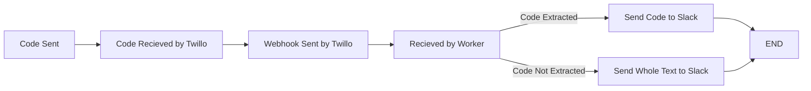

# Revolution MFA
Our solution for team accounts that need 2fa yet only support mobile auth.

## Architecture

## Credits
- Took MFA regex's from [Hackclub's solution](https://github.com/hackclub/mfa)

## Used By
- Us
